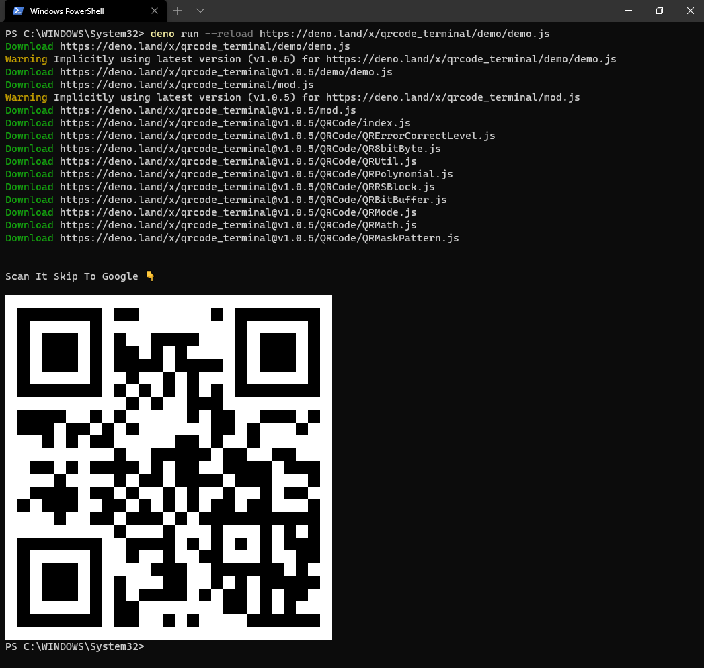

# QRCode Terminal For Deno

<a href="https://deno.land">
    
</a>

## 😎Run the Demo
```bash
deno run https://deno.land/x/qrcode_terminal/demo/demo.js
```

## 🔎Examples
```js
import qrcode from 'https://deno.land/x/qrcode_terminal/mod.js'

console.log("\n\nScan It Skip To Google 👇\n")
qrcode.generate("https://www.google.com")
```

#### output:  


## 📃Usage
To display some data to the terminal just call:
```js
qrcode.generate('This will be a QRCode, eh!');
```
You can even specify the error level (default is 'L'):
```js
qrcode.setErrorLevel('Q');
qrcode.generate('This will be a QRCode with error level Q!');
```
If you don't want to display to the terminal but just want to string you can provide a callback:
```js
qrcode.generate('http://github.com', function (qrcode) {
    console.log(qrcode);
});
```
If you want to display small output, provide `opts` with `small`:
```js
qrcode.generate('This will be a small QRCode, eh!', {small: true});

qrcode.generate('This will be a small QRCode, eh!', {small: true}, function (qrcode) {
    console.log(qrcode)
});
```

## 🤝Acknowledgments
Special thanks to the prior work by @gtanner in [qrcode-terminal](https://github.com/gtanner/qrcode-terminal).

## ☕Buy me a cup of coffee
If you think the project has helped you, you can buy a cup of coffee for the author as a sign of encouragement 👇
```bash
deno run https://deno.land/x/qrcode_terminal/support/buy-me-a-cup-of-coffee.js
```

## 🔑License
[Do What The Fuck You Want To Public License](./LICENSE)
